# Raft Queue Topology

This is the target shape for keeping 5-tuples, RX queues, Raft shards, WAL
buffers, and TX queues aligned. The current TCP ZCRX WAL path follows the RX
half of this plan: accepted sockets are mapped by observed NAPI/RXQ, each worker
owns one ZCRX IFQ and io_uring ring, and WAL offsets are now carved into
per-worker regions after shard assignment.

```mermaid
flowchart LR
    subgraph PeerA[leader node]
        C0[client/Raft lane 0<br/>5-tuple A]
        C1[client/Raft lane 1<br/>5-tuple B]
        Cn[client/Raft lane N<br/>5-tuple N]
    end

    subgraph NICIn[netdevsim or real NIC RX]
        RSS[5-tuple hash / RSS indirection]
        RXQ0[RXQ 0<br/>NAPI id 0<br/>IRQ vector 0]
        RXQ1[RXQ 1<br/>NAPI id 1<br/>IRQ vector 1]
        RXQN[RXQ N<br/>NAPI id N<br/>IRQ vector N]
        Z0[ZCRX area 0<br/>fixed buffers / io slots]
        Z1[ZCRX area 1<br/>fixed buffers / io slots]
        ZN[ZCRX area N<br/>fixed buffers / io slots]
    end

    subgraph Workers[CPU-local Raft shards]
        W0[CPU k<br/>shard 0<br/>io_uring ring 0]
        W1[CPU k+1<br/>shard 1<br/>io_uring ring 1]
        WN[CPU k+N<br/>shard N<br/>io_uring ring N]
        S0[shard semaphore 0<br/>recv credits + WAL credits + TX credits]
        S1[shard semaphore 1<br/>recv credits + WAL credits + TX credits]
        SN[shard semaphore N<br/>recv credits + WAL credits + TX credits]
    end

    subgraph WAL[NVMe WAL]
        Q0[NVMe queue near CPU k]
        Q1[NVMe queue near CPU k+1]
        QN[NVMe queue near CPU k+N]
        R0[WAL region 0<br/>slot writes]
        R1[WAL region 1<br/>slot writes]
        RN[WAL region N<br/>slot writes]
    end

    subgraph NICOut[netdevsim or real NIC TX]
        SQ0[send queue 0]
        SQ1[send queue 1]
        SQN[send queue N]
        DEV[wire / fabric]
    end

    C0 --> RSS --> RXQ0 --> Z0 --> W0 --> S0 --> Q0 --> R0 --> SQ0 --> DEV
    C1 --> RSS --> RXQ1 --> Z1 --> W1 --> S1 --> Q1 --> R1 --> SQ1 --> DEV
    Cn --> RSS --> RXQN --> ZN --> WN --> SN --> QN --> RN --> SQN --> DEV

    W0 -. quorum/commit index .-> W1
    W1 -. quorum/commit index .-> WN
```

## Alignment Rules

- One lane is a stable 5-tuple family, not a hard port-to-CPU contract. The
  socket's observed `SO_INCOMING_NAPI_ID` or explicit `NAPI:RXQ` map decides
  the shard when available; port lane is only fallback.
- A shard owns a worker CPU, RXQ, ZCRX area, io_uring ring, fixed-buffer table,
  io-slot table, WAL offset region, and outbound lane budget.
- ZCRX memory is first-touched after the worker is pinned. Optional
  `URING_PLAY_ZCRX_MEMBIND=1` or `URING_PLAY_WAL_MEMBIND=1` asks Linux to prefer
  the worker NUMA node before pages are faulted and pinned.
- WAL writes use direct-I/O-aligned slot strides. The slot stride is at least
  the block-device alignment and auto-widens when a large ZCRX area would exceed
  the 16,384 registered-buffer limit. It also reserves entries for aligned
  bounce buffers used only when a CQE cannot be submitted as a direct io-slot
  write.
- ZCRX receive buffers should request an aligned power-of-two size with
  `URING_PLAY_ZCRX_RX_BUF_LEN` when the NIC and kernel support selectable RX
  page sizes. For the current netdevsim WAL tests that is normally the TCP chunk
  size, such as 8192 bytes.
- The NVMe target is split into per-shard regions after sockets are accepted and
  assigned. That removes the shared WAL allocation atomic from the hot path and
  keeps each worker appending with a plain local cursor inside a local stripe.
- If the device rejects the requested ZCRX RX buffer size or returns CQEs whose
  offset or length misses the direct io-slot boundary, the worker keeps ordering
  by copying only those CQEs into its own aligned bounce slot. The benchmark
  reports `direct_frames`, `direct_bytes`, `bounce_frames`, `bounce_bytes`, and
  physical `wal_bytes` so this is visible.
- For a real NVMe device, choose worker CPUs from `/sys/block/<dev>/mq/*/cpu_list`
  and keep the worker's WAL region on the ring submitted from that CPU. The
  `slot-topology-plan` command prints the intended CPU, queue, ring, and region
  map.

## Ordering And Semaphores

- Each shard has three tight credit counters: RX frame credits, WAL write
  credits, and TX/send credits. A ZCRX frame is not returned to the RX refill
  queue until all slot writes for that frame complete.
- Per-shard WAL order is a monotonic local append. Cross-shard Raft order should
  be carried by logical log indexes in the records, then released by a small
  commit sequencer once quorum acks make the prefix durable.
- Quorum acks should return `(term, index, shard, lane)` rather than global byte
  offsets. This lets physical WAL layout stay striped while the Raft state
  machine still commits a single ordered prefix.
- The outbound path should use the same lane identity where possible: the shard
  that owns the incoming request queues the append/reply onto the matching
  send ring and send queue, keeping cache ownership and backpressure local.
